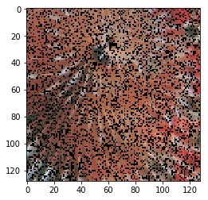
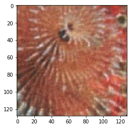
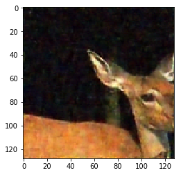
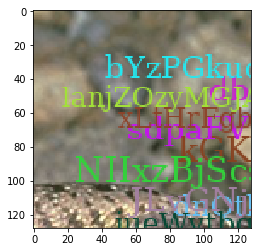
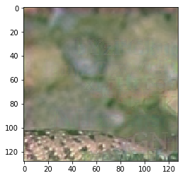
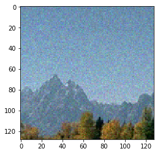
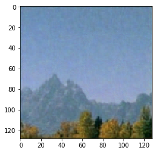

# Deep-Restore-PyTorch
Deep CNN for learning image restoration without clean data!

## Introduction
Image restoration is task in which we have a noisy input image and we desire to get a noise free output image. Several techniques have been proposed for this task. One is using the Light Transport Simulation algorithm, which traces the path of millions of light rays. The disadvantage of this technique is the rendering time. It may take upto hours to render a single scene. 
Recently Convolutional Neural Networks have been proposed to solve this problem, which they do and also achieve state of the art results. They can learn the concept of noise, hence when provided with unseen noisy image, it can generate a noise free image easily in very less time. We can simply train a CNN for this task by providing noisy image as input and clean image as target and minimize a loss function using gradient descent.

## The Problem
It works. Works pretty well indeed. But there are cases where it is not just expensive but impossible to create clean images for our training data. Low light photography, Astronomical Imaging or Magnetic Resonance Imaging (MRI) are few of such cases. Neural Network based techniques cannot be easily used for this case.

## The Solution
Here comes a novel technique to address this issue. This method uses only noisy images to train the neural network to produce clean image as output. No clean images are required whatsoever for this technique.

## A Few Samples
### Multiplicative Bernoulli Noise Removal
 
### Gaussian Noise Removal
 
### Corrupt Text Removal
  
### Poisson Noise Removal
 
#### Note: I am not yet sure about how poisson noise needs to be implemented because it's not additive and is signal dependent while the paper simply mentions using a constant lambda. 

#### The minor artifacts seen are due to the following
1. Only 291 images were used for training.
2. The images were random cropped to 64 x 64 for quick training. 
Progressive resizing could be incorporated along with more images to get high resolution results.

## How does this even work?
Assume that we have a set of unreliable measurements (y1, y2, y3...) of the room temperature. A common strategy for estimating the true unknown temperature is to find a number z that has smallest average deviation from our input data points, according to some loss function L.  
When L is squared error, we find minimum is found at arithmetic mean of our input data points. Similarly when L is L1 loss, we find the minimum to be at the median of our input data points. 
#### We use similar analogy here to train our neural network.
Given a loss function L, we minimize the loss with input datapoints (noisy images) to learn a function N, where N is a Convolutional Neural Network. This allows the network to generate noise free images as we learn the function N.  
This effectively reduces our task of training our neural network model with only noisy/corrupted images.

## References:
[Noise2Noise Paper](https://arxiv.org/pdf/1803.04189.pdf)

